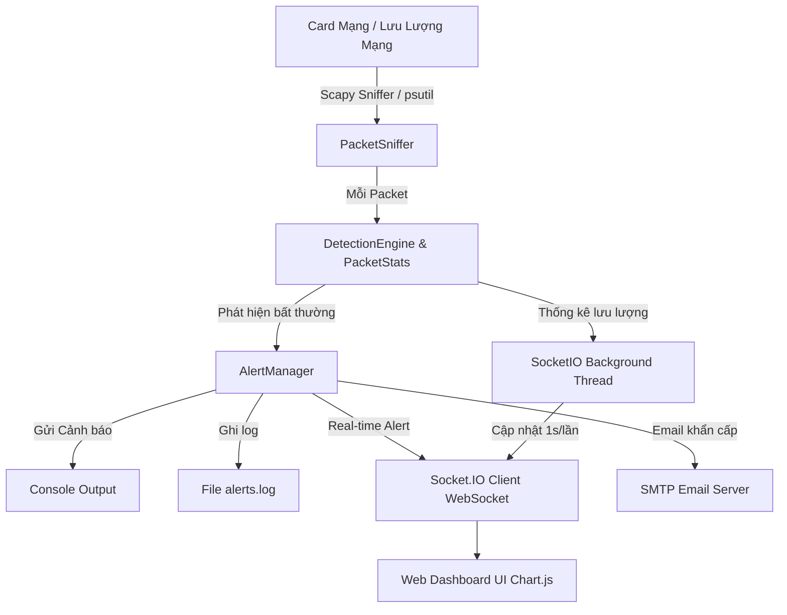

# 🛡️ GIẢI THÍCH CHI TIẾT DỰ ÁN HỆ THỐNG PHÁT HIỆN XÂM NHẬP MẠNG (IDS)

> 📘 **Tài liệu dành cho người mới bắt đầu**: File này giải thích toàn bộ chức năng, kiến trúc kỹ thuật và cách vận hành của chương trình một cách dễ hiểu nhất, không yêu cầu kiến thức nâng cao trước đó.

---

## 📖 MỤC LỤC
1. [Khái niệm Cơ bản - IDS là gì?](#1-khái-niệm-cơ-bản---ids-là-gì)
2. [Tổng quan Chức năng của Chương trình](#2-tổng-quan-chức-năng-của-chương-trình)
3. [5 Dạng Tấn công Mạng Hệ thống Có thể Phát hiện](#3-5-dạng-tấn-công-mạng-hệ-thống-có-thể-phát-hiện)
4. [Cách thức Hoạt động Kỹ thuật (Luồng Dữ liệu)](#4-cách-thức-hoạt-động-kỹ-thuật-luồng-dữ-liệu)
5. [Cấu trúc Dự án & Phân công Nhiệm vụ từng File](#5-cấu-trúc-dự-án--phân-công-nhiệm-vụ-từng-file)
6. [Hệ thống Cảnh báo Đa kênh](#6-hệ-thống-cảnh-báo-đa-kênh)
7. [Hướng dẫn Chạy và Trải nghiệm từ A - Z](#7-hướng-dẫn-chạy-và-trải-nghiệm-từ-a---z)
8. [Những Điểm Sáng Kỹ thuật của Dự án](#8-những-điểm-sáng-kỹ-thuật-của-dự-án)

---

## 1. KHÁI NIỆM CƠ BẢN - IDS LÀ GÌ?

Hãy hình dung **Mạng máy tính** giống như một **con đường giao thông đông đúc**:
- Các **Gói tin (Packets)** là những chiếc xe chạy qua lại mang theo dữ liệu (trang web, hình ảnh, tin nhắn).
- **Hệ thống IDS (Intrusion Detection System)** đóng vai trò như **hệ thống Camera giám sát giao thông thông minh**.

Camera này đứng ở bên đường, liên tục nhìn từng chiếc xe chạy qua. Nếu nó phát hiện ra chiếc xe nào chạy quá tốc độ, đi ngược chiều, hoặc có dấu hiệu muốn phá hoại, nó sẽ ngay lập tức **phát chuông cảnh báo và ghi sổ nhật ký** cho người quản trị biết.

> [!NOTE]
> Dự án **IDS (PBL4)** này là một ứng dụng phần mềm bằng Python, giúp bạn giám sát mạng nội bộ của máy tính real-time (theo thời gian thực), phát hiện các đợt tấn công mạng bất thường và hiển thị tất cả lên một giao diện Web trực quan.

---

## 2. TỔNG QUAN CHỨC NĂNG CỦA CHƯƠNG TRÌNH

Chương trình được tích hợp đầy đủ các chức năng của một hệ thống giám sát an ninh mạng hoàn chỉnh:

| STT | Chức năng | Mô tả chi tiết |
|---|---|---|
| 1 | 📡 **Bắt & Giám sát gói tin (Sniffing)** | Liên tục thu thập các gói tin chạy qua card mạng (Ethernet, Wi-Fi, Loopback). |
| 2 | 🚨 **Phát hiện Xâm nhập Tự động** | Kiểm tra lưu lượng gói tin dựa trên các quy luật và ngưỡng định sẵn để phát hiện tấn công. |
| 3 | 📊 **Giao diện Web Dashboard Real-time** | Hiển thị biểu đồ tốc độ (Packets/s), lưu lượng (Bytes), tỷ lệ giao thức (TCP, UDP, ICMP, ARP) sống động. |
| 4 | 🕹️ **Điều khiển Bật / Dừng Sniffer** | Nút bấm trên giao diện Web cho phép khởi động hoặc tạm dừng việc lắng nghe gói tin bất kỳ lúc nào. |
| 5 | 🔀 **Chọn Card Mạng (Network Interface)** | Cho phép chọn card mạng cụ thể muốn giám sát ngay trên trang Web. |
| 6 | 🔔 **Cảnh báo Đa kênh** | Đẩy cảnh báo tức thì qua: Thông báo Toast trên Web, In màu ra Console, Ghi file log `alerts.log`, Gửi Email SMTP. |
| 7 | 🔄 **Chế độ Giám sát Dự phòng (System Monitor)** | Nếu không chạy quyền Admin hoặc thiếu driver Npcap, hệ thống tự động chuyển sang đọc thông số OS qua `psutil` để giao diện luôn chạy mượt mà. |
| 8 | 🧪 **Công cụ Mô phỏng Tấn công (Testing Tool)** | Cung cấp script `test_attack.py` và nút bấm trên Web để giả lập 5 cuộc tấn công thử nghiệm khả năng của hệ thống. |

---

## 3. 5 DẠNG TẤN CÔNG MẠNG HỆ THỐNG CÓ THỂ PHÁT HIỆN

Hệ thống tập trung phát hiện 5 kỹ thuật tấn công phổ biến nhất hiện nay:

```
                          ┌──────────────────────────┐
                          │    HỆ THỐNG IDS (ENGINE) │
                          └────────────┬─────────────┘
                                       │
      ┌────────────────┬───────────────┼───────────────┬────────────────┐
      │                │               │               │                │
┌─────▼──────┐  ┌──────▼─────┐  ┌──────▼─────┐  ┌──────▼─────┐  ┌───────▼──────┐
│ Port Scan  │  │ SYN Flood  │  │ UDP Flood  │  │ ICMP Flood │  │ ARP Spoofing │
│ (Quét cổng)│  │ (TCP DoS)  │  │ (UDP DoS)  │  │(Ping Flood)│  │  (Giả mạo)   │
└────────────┘  └────────────┘  └────────────┘  └────────────┘  └──────────────┘
```

1. 🔍 **Port Scan (Quét cổng dịch vụ)**:
   - *Kẻ tấn công làm gì*: Gửi yêu cầu kết nối thử đến hàng chục, hàng trăm cổng (ports) trên máy nạn nhân để tìm xem có dịch vụ nào đang mở (như Web port 80, SSH port 22, Database port 3306...).
   - *Luật phát hiện*: Nếu 1 IP nguồn kết nối đến **> 20 cổng khác nhau trong 10 giây** $\rightarrow$ Báo động `PORT_SCAN` (Mức độ `HIGH`).

2. 🌊 **SYN Flood (Tấn công từ chối dịch vụ TCP)**:
   - *Kẻ tấn công làm gì*: Gửi dồn dập hàng ngàn gói tin xin bắt tay TCP (cờ SYN) nhưng không bao giờ hoàn tất bắt tay, làm kiệt sức bộ nhớ của máy chủ.
   - *Luật phát hiện*: Nếu 1 IP nguồn gửi **> 100 gói SYN trong 1 giây** $\rightarrow$ Báo động `SYN_FLOOD` (Mức độ `CRITICAL`).

3. 🌊 **UDP Flood (Tấn công ngập lụt UDP)**:
   - *Kẻ tấn công làm gì*: Gửi dồn dập lượng lớn gói tin UDP vào các cổng ngẫu nhiên khiến máy chủ phải tốn tài nguyên xử lý phản hồi "Destination Unreachable".
   - *Luật phát hiện*: Nếu 1 IP nguồn gửi **> 200 gói UDP trong 1 giây** $\rightarrow$ Báo động `UDP_FLOOD` (Mức độ `HIGH`).

4. 🏓 **ICMP Flood (Ping Flood)**:
   - *Kẻ tấn công làm gì*: Gửi liên tục hàng loạt lệnh Ping (ICMP Echo Request) chiếm dụng toàn bộ băng thông mạng.
   - *Luật phát hiện*: Nếu 1 IP nguồn gửi **> 50 gói ICMP trong 1 giây** $\rightarrow$ Báo động `ICMP_FLOOD` (Mức độ `MEDIUM`).

5. 🎭 **ARP Spoofing (Giả mạo địa chỉ ARP trong mạng LAN)**:
   - *Kẻ tấn công làm gì*: Gửi thông điệp ARP giả mạo để nhận mình là Gateway/Router, từ đó đánh chặn toàn bộ dữ liệu của máy nạn nhân (Man-in-the-Middle).
   - *Luật phát hiện*: Nếu 1 địa chỉ IP bị phát hiện liên kết với **từ 2 địa chỉ MAC (phần cứng) khác nhau trở lên** $\rightarrow$ Báo động `ARP_SPOOFING` (Mức độ `CRITICAL`).

---

## 4. CÁCH THỨC HOẠT ĐỘNG KỸ THUẬT (LUỒNG DỮ LIỆU)

Hệ thống hoạt động theo mô hình **4 Tầng Kiến trúc Kiến trúc Luồng (Architecture Dataflow)**:



### Bước 1: Thu thập dữ liệu (Packet Sniffing)
- Thư viện `Scapy` bắt từng khung dữ liệu mạng ở Tầng 2 (Ethernet) hoặc Tầng 3 (IP).
- Trích xuất thông tin quan trọng: **IP Nguồn (Source IP), IP Đích (Destination IP), Port Nguồn/Đích, Giao thức (TCP/UDP/ICMP/ARP), Cờ TCP (SYN/ACK), Dung lượng gói tin**.

### Bước 2: Phân tích & Đếm số liệu (Detection & Analytics)
- Gói tin được đưa vào `PacketStats` để tính tốc độ mạng (Packets/giây), phân loại tỷ lệ giao thức và ghi nhận Top IP gửi/nhận nhiều nhất.
- Đồng thời, gói tin đi qua `DetectionEngine`: Lưu lịch sử truy cập vào các danh sách trượt theo cửa sổ thời gian (Sliding Window List).

### Bước 3: Đưa ra Cảnh báo (Alert Trigger)
- Khi phát hiện một chỉ số vượt quá ngưỡng cho phép trong `config.py`, `DetectionEngine` tạo ra một đối tượng `Alert`.
- Đối tượng này lập tức được truyền sang `AlertManager`.

### Bước 4: Đẩy lên Web & Cập nhật Real-time (Web Synchronization)
- Flask-SocketIO duy trì một kênh kết nối WebSocket mở liên tục giữa Python backend và Trình duyệt web client.
- Cứ mỗi 1 giây, backend tự động gửi dữ liệu số liệu mới nhất lên Web để vẽ lại biểu đồ Chart.js mà **không cần người dùng phải nhấn F5 / reload trang**.

---

## 5. CẤU TRÚC DỰ ÁN & PHÂN CÔNG NHIỆM VỤ TỪNG FILE

Mã nguồn được tổ chức rất gọn gàng, tách biệt rõ ràng giữa logic xử lý backend và giao diện frontend:

```text
PBL4/
├── app.py                  # 🚀 Server Flask & Quản lý WebSocket / API Endpoints
├── ids_core.py             # 🧠 Trái tim IDS (Lắng nghe gói tin & Thuật toán phát hiện)
├── alert_manager.py        # 🔔 Quản lý Cảnh báo (In Console, Ghi log, Gửi Email)
├── config.py               # ⚙️ File Cấu hình Hệ thống (Ngưỡng, Cổng Web, Email SMTP)
├── test_attack.py          # 🧪 Script Công cụ Mô phỏng Tấn công để Kiểm thử
├── requirements.txt        # 📦 Danh sách các thư viện Python phụ thuộc
├── TONG_QUAN_VA_CACH_HOAT_DONG.md # 📘 Tài liệu hướng dẫn chi tiết này
├── alerts.log              # 📝 Nhật ký ghi nhận lịch sử cảnh báo (tự động tạo)
├── templates/
│   └── dashboard.html      # 💻 Giao diện Dashboard HTML5
└── static/
    ├── css/
    │   └── style.css       # 🎨 Stylesheet Dark Theme Glassmorphism cực đẹp
    └── js/
        └── dashboard.js    # ⚡ Logic Javascript phía Client (Socket.IO + Chart.js)
```

### Chi tiết vai trò của các file chính:

1. **`ids_core.py`** *(Core Engine)*:
   - `PacketSniffer`: Lắng nghe card mạng. Tự động chuyển chế độ thông minh nếu không có quyền Admin.
   - `DetectionEngine`: Chứa các thuật toán kiểm tra Port Scan, SYN Flood, UDP Flood, ICMP Flood, ARP Spoofing.
   - `PacketStats`: Bộ đếm số liệu lưu lượng real-time.

2. **`app.py`** *(Web Server)*:
   - Khởi tạo server Flask và WebSocket SocketIO tại cổng 5000.
   - Cung cấp các API REST (`/api/stats`, `/api/alerts`, `/api/sniffer/start`, `/api/interfaces`...).
   - Chạy 2 luồng ngầm (Background Threads): Đẩy số liệu định kỳ lên Web và dọn dẹp bộ nhớ định kỳ.

3. **`alert_manager.py`** *(Alert Processing)*:
   - Đảm nhận việc xuất cảnh báo ra 4 kênh: Console màn hình, File `alerts.log`, WebSocket đẩy lên Web Toast, và gửi Email SMTP.

4. **`config.py`** *(Configuration)*:
   - Nơi điều chỉnh tất cả các con số: Ngưỡng phát hiện (ví dụ: đổi 20 ports thành 10 ports), thông tin Email Gmail SMTP, cổng Dashboard.

5. **`test_attack.py`** *(Testing Script)*:
   - Công cụ tạo ra các gói tin giả lập (bằng Scapy hoặc socket) để thử nghiệm tính năng phát hiện của IDS mà không cần phải thực hiện tấn công thật.

6. **`dashboard.html` & `dashboard.js` & `style.css`** *(Web Frontend)*:
   - Xây dựng giao diện Dark Mode phong cách hiện đại (Glassmorphism).
   - Tích hợp **Chart.js** vẽ 4 biểu đồ: Tốc độ mạng (Line Chart), Phân bố giao thức (Doughnut Chart), Top IP gửi nhiều nhất (Bar Chart), Phân loại loại tấn công (Bar Chart).

---

## 6. HỆ THỐNG CẢNH BÁO ĐA KÊNH

Mỗi khi phát hiện mối đe dọa, hệ thống sẽ thực hiện đồng thời 4 hành động:

1. **In ra Console**: Hiển thị khung thông báo nhiều màu sắc (Đỏ = CRITICAL/HIGH, Vàng = MEDIUM, Xanh = LOW) kèm đầy đủ IP nguồn, mô tả và chi tiết kỹ thuật.
2. **Ghi File Log (`alerts.log`)**: Lưu lại toàn bộ lịch sử cảnh báo theo định dạng tiêu chuẩn có mốc thời gian `[YYYY-MM-DD HH:MM:SS]` để tra cứu sau này.
3. **Đẩy lên Web Dashboard**: Hiển thị bảng chi tiết có thể nhấn mở rộng (Expandable Row) và hiển thị khung thông báo nổi (Toast Notification) ở góc màn hình.
4. **Gửi Email SMTP**: Khi gặp cảnh báo từ mức `HIGH` hoặc `CRITICAL` trở lên, hệ thống kích hoạt luồng riêng tự động gửi Email HTML với định dạng chuyên nghiệp tới hộp thư của quản trị viên.

---

## 7. HƯỚNG DẪN CHẠY VÀ TRẢI NGHIỆM TỪ A - Z

### Bước 1: Khởi động Server IDS
Mở **Command Prompt (CMD)** hoặc **PowerShell** tại thư mục dự án và chạy:

```cmd
.venv\Scripts\python.exe app.py
```

> [!TIP]
> Để bắt gói tin thực sự từ Card mạng thật (Wi-Fi/Ethernet), hãy mở Terminal với quyền **Run as Administrator**.

### Bước 2: Truy cập Web Dashboard
Mở trình duyệt Web (Chrome, Edge, Firefox...) và truy cập:
👉 **`http://localhost:5000`**

Bạn sẽ thấy giao diện Dashboard hiện ra với các số liệu lưu lượng mạng nhảy theo thời gian thực!

### Bước 3: Thử nghiệm Tính năng Mô phỏng Tấn công
Mở **thêm 1 cửa sổ Terminal mới** và chạy lệnh:

```cmd
# Chạy mô phỏng tất cả 4 dạng tấn công:
.venv\Scripts\python.exe test_attack.py all 127.0.0.1
```

Hoặc thử từng dạng tấn công lẻ:
```cmd
.venv\Scripts\python.exe test_attack.py port_scan 127.0.0.1
.venv\Scripts\python.exe test_attack.py syn_flood 127.0.0.1
.venv\Scripts\python.exe test_attack.py udp_flood 127.0.0.1
.venv\Scripts\python.exe test_attack.py icmp_flood 127.0.0.1
```

👉 **Kết quả**: Ngay lập tức trên Web Dashboard sẽ xuất hiện thông báo Toast đỏ, biểu đồ biến động và bảng cảnh báo hiển thị chi tiết đợt tấn công vừa diễn ra!

---

## 8. NHỮNG ĐIỂM SÁNG KỸ THUẬT CỦA DỰ ÁN

1. ⚡ **Real-time 100%**: Sử dụng WebSockets (Socket.IO) thay vì Polling liên tục, giúp tiết kiệm tài nguyên mạng và cập nhật số liệu mượt mà không độ trễ.
2. 🛡️ **Khả năng tự phục hồi & Fallback thông minh**: Hệ thống không bị crash kể cả khi người dùng quên bật quyền Admin hoặc thiếu driver Npcap. Nó tự động chuyển sang chế độ đọc thông số hệ thống qua `psutil`.
3. 🧹 **Tự động quản lý bộ nhớ**: Tích hợp cơ chế tự động dọn dẹp (Cleanup Thread) sau mỗi 60s và giới hạn danh sách lưu giữ (Sliding Window) tránh tràn RAM khi chạy lâu.
4. 🎨 **Giao diện hiện đại**: Thiết kế Dark Mode chuyên nghiệp, hiển thị trực quan số liệu an toàn mạng như các công cụ giám sát Security Operation Center (SOC) thực tế.

---
*Tài liệu này được biên soạn cho dự án PBL4 - Hệ thống Phát hiện Xâm nhập Mạng IDS.*
